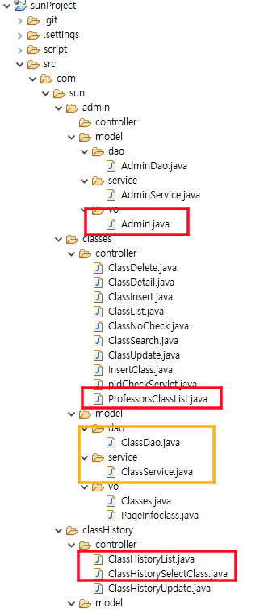
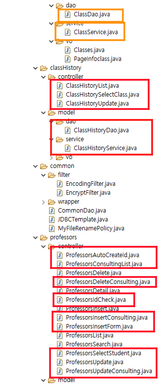
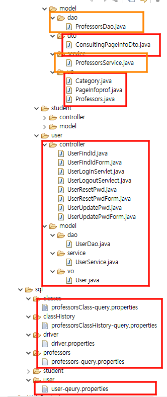
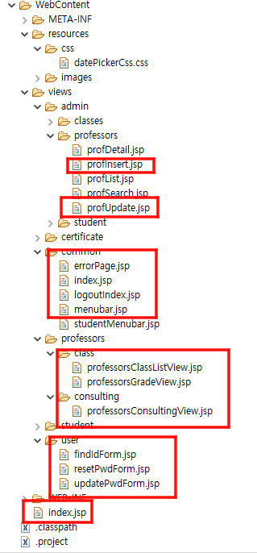
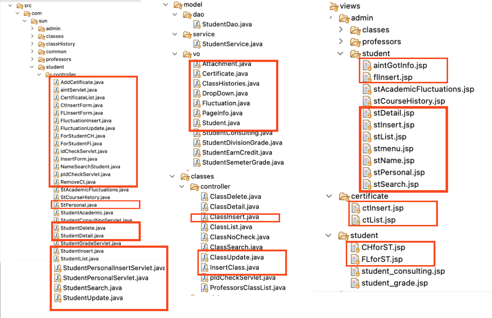
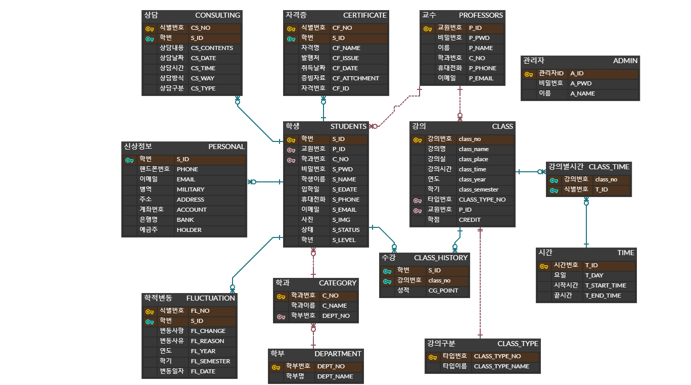

# sunProject
## 역할
- 이윤정(팀장)
1. 로그인, 로그아웃, 메뉴바
2. 학번/교원번호 찾기
3. 비밀번호 초기화/재설정
4. 교수 > 강의 목록 조회, 강의명으로 검색
5. 교수 > 성적 입력
6. 교수 > 지도학생 상담 내역 추가, 수정, 삭제, 조회
7. 관리자> 교수 추가, 수정

[아래 사진은 단독으로 사용한 파일은 빨간색 박스. 겹친 부분은 주황색 박스로 체크]

- 왕수빈
1. 관리자 > 학생 리스트, 학번/이름으로 검색
2. 관리자 > 학생 추가, 학생 정보 수정, 학생 삭제
3. 관리자 > 학적 리스트, 학적 추가, 학적 정보 수정
4. 관리자 > 강의 추가, 수정
5. 학생 > 신상 정보 수정, 학적 변동 조회, 수강 내역 조회
6. 학생 > 자격증 리스트, 추가, 삭제

[아래 사진은 단독으로 사용한 파일만 체크하였음.]
 

- 상예진
1. 로그인 후 메인 페이지
2. 학생 > 학적조회, 상담조회, 성적조회 
3. 학생 > 증명서발급

- 김성대
1. 관리자 > 강의 리스트, 삭제
2. 관리자 > 교수 리스트, 삭제

- 강재석
1. \0

## ERD

